# AGI01 热点内容运营引擎产品与架构计划

## 1. 目标

AGI01 要做的不是通用 CMS，而是一个面向 AI builder 内容账号的内部运营引擎：

```text
热点来源 -> 抓取入库 -> AI 去重/评分/筛选 -> 创建选题 -> skill 写作 -> 中英文母稿 -> 多平台适配 -> 审核 -> 导出/发布 -> 数据反馈
```

第一版目标是半自动闭环。系统自动发现、评分、生成和打包，运营人员负责选题判断、事实审核、风格把关和最终发布。

## 2. 关键原则

- 先做内部编辑驾驶舱，不做面向公众的 CMS。
- 来源负责发现热点，不等于事实来源；写作前必须补充一手来源、论文、仓库、官方公告或可靠媒体。
- 通义千问是默认大模型 provider，但业务代码必须通过 `api/internal/capabilities/ai` 抽象调用。
- 每个文章产物都记录模型、prompt、skill 快照、引用来源和质量检查结果。
- 每个平台不是硬编码页面逻辑，而是由 `platform_profiles` 定义风格、格式和限制。
- 第一版以复制、导出、人工发布为主，不急于打通所有平台自动发布。

## 3. 通义千问接入方案

阿里云百炼支持 OpenAI 兼容接口。官方文档说明迁移时主要替换 API Key、BASE_URL 和模型名：

- 文档：https://www.alibabacloud.com/help/en/model-studio/compatibility-of-openai-with-dashscope
- 模型列表：https://www.alibabacloud.com/help/en/model-studio/models

推荐环境变量：

```bash
AI_ENABLED=true
AI_DEFAULT_PROVIDER=dashscope
AI_DEFAULT_MODEL=qwen-plus
AI_REQUEST_TIMEOUT=120s

DASHSCOPE_API_KEY=
DASHSCOPE_BASE_URL=https://dashscope.aliyuncs.com/compatible-mode/v1
```

不要把 API Key 写入代码、文档、日志、测试快照或提交记录。密钥只允许通过本地 `.env`、服务器环境变量或后续 secret manager 注入。

当前项目已有 `api/internal/capabilities/ai` provider seam，但现有 `openai` provider 使用 OpenAI Responses API 的 `/responses`。DashScope 兼容接口走 `/chat/completions`，因此需要新增 `dashscope` provider，而不是只替换 `OPENAI_BASE_URL`。

建议实现方式：

- 新增 `ProviderDashScope = "dashscope"`。
- 扩展 `ai.Config`，增加 `DashScope ProviderConfig`。
- 新增 `dashscope.go`，直接用 Go HTTP 调用 `/chat/completions`。
- 支持非流式文本生成，后续再补 streaming。
- 请求使用 `messages`：system 放 `Instructions`，user 放 `Input`。
- 响应取 `choices[0].message.content`。
- 记录 usage、request id、latency 和错误类型到 `generation_runs` 或模型调用日志。

推荐模型策略：

| 任务 | 推荐模型 | 原因 |
|---|---|---|
| 热点评分 | `qwen-flash` 或 `qwen-plus` | 成本低，结构化判断足够 |
| 研究 brief | `qwen-plus` | 需要摘要、判断和结构化输出 |
| 中文母稿 | `qwen-plus` 或更强模型 | 需要长文质量和风格稳定 |
| 英文适配 | `qwen-plus` | 需要保留事实并重写语境 |
| 平台改写 | `qwen-flash` 或 `qwen-plus` | 重写任务可控，适合批量 |
| 质量检查 | `qwen-flash` | 规则化检查，成本优先 |

## 4. 总体架构

```mermaid
flowchart LR
  S["Sources: daily.dev, HN, GitHub, HF Papers, arXiv, Product Hunt, RSS"] --> I["Ingest adapters"]
  I --> T["trend_items / source_raw_items"]
  T --> C["trend_clusters"]
  C --> E["AI evaluation via DashScope"]
  E --> R["Trend Radar"]
  R --> P["article_projects"]
  P --> K["skill_snapshots"]
  K --> W["article_runs workflow"]
  W --> A["article_artifacts"]
  A --> Q["quality_checks / reviews"]
  Q --> M["platform_renditions"]
  M --> U["publish_jobs"]
  U --> F["content_metrics feedback"]
  F --> E
```



## 5. 已有基础

当前仓库已经落地第一段能力：

- `api/internal/modules/trend`：daily.dev highlights 抓取、入库、规则评分、列表接口。
- `api/cmd/trend-sync`：支持 `--once` 和 `--interval=10m`。
- `web/src/features/trends`：后台热点雷达页面。
- `api/database/schema/content_pipeline.sql` 和 migration：已有内容流水线基础表。
- 测试环境已经部署过 Docker Compose：api、web、sync worker。

已有内容表雏形：

| 已有表 | 作用 |
|---|---|
| `skill_repositories` | skill 仓库配置 |
| `skill_snapshots` | 不可变 skill 快照 |
| `content_sources` | 热点来源 |
| `trend_items` | 标准化热点 |
| `trend_evaluations` | 热点评分 |
| `article_projects` | 文章项目 |
| `article_runs` | 文章生成运行 |
| `article_artifacts` | 文章产物 |
| `article_reviews` | 审核记录 |
| `media_assets` | 图片和媒体资产 |
| `automation_jobs` | 后台任务 |
| `publication_packages` | 发布包雏形 |

## 6. 开发阶段

### P0: AI provider 和配置

目标：让系统可以安全、可测试地调用通义千问。

交付：

- `dashscope` provider。
- AI provider 测试接口。
- 模型 profile 配置。
- 模型调用日志。
- `.env.example` 更新，不包含真实 key。
- Kest flow 覆盖模型测试接口。

验收：

- 本地和测试环境都能用环境变量调用 DashScope。
- 密钥不出现在前端、日志、git diff、错误响应。
- 模型无效、key 无效、超时、空响应都有稳定错误。

### P1: 来源中心和热点雷达增强

目标：把热点发现从单一 daily.dev 扩成可配置来源体系。

交付：

- 来源设置页面。
- 来源抓取运行记录。
- raw item 保存。
- daily.dev、HN Algolia、GitHub Trending、Hugging Face Papers、arXiv、Product Hunt 的 adapter 骨架。
- 热点详情页。
- AI 评分替代当前规则评分，规则评分作为 fallback。

验收：

- 10 分钟同步任务继续可用。
- 单个来源失败不影响其他来源。
- 热点详情展示原始来源、评分理由、相似热点和操作按钮。

### P2: 选题和文章项目

目标：让运营从热点创建文章项目，生成研究 brief 和选题卡。

交付：

- 文章列表页。
- 文章详情工作台。
- 从热点创建文章项目。
- 手动创建文章项目。
- `research_brief` artifact。
- `topic_card` artifact。
- 文章运行状态机。

验收：

- candidate 热点可一键创建文章项目。
- 研究 brief 必须包含引用或明确标记为待验证。
- 生成失败可重试，人工编辑不被覆盖。

### P3: Skill 写作流水线

目标：用 `happycto/agi01-skills` 生成文章产物。

交付：

- Skill 库页面。
- skill 同步 job。
- skill 快照解析和引用。
- outline、中文母稿、英文适配稿、标题候选、图片计划、质量报告。
- 文章 artifact 版本管理。

验收：

- 每个 artifact 记录 skill_snapshot_ids。
- skill 仓库不可用时使用上一版快照。
- 重新生成只创建新版本，不覆盖已批准版本。

### P4: 多平台适配

目标：一篇母稿生成多个平台版本。

交付：

- 平台 profile 配置。
- 多平台适配页面。
- 公众号、知乎、飞书、小红书、X、LinkedIn 的默认 profile。
- Markdown、HTML、纯文本导出。
- 平台限制检查。

验收：

- 每个平台版本可以单独编辑、重新生成和审批。
- 平台改写不能新增未经验证事实。
- 小红书版本包含标题、正文、卡片建议、标签和图片 prompt。

### P5: 发布队列

目标：管理人工发布和半自动发布状态。

交付：

- 发布队列页面。
- 发布目标配置。
- 发布 job。
- 标记已发布、失败、重试。
- 公众号 HTML、小红书文案、知乎 Markdown、飞书 Markdown 导出。

验收：

- 未审核内容不能进入发布队列。
- 每个发布动作可追踪负责人、时间、平台 URL。
- 发布失败保留原因，可退回修改。

### P6: 数据反馈和优化

目标：把发布效果反哺选题和写作。

交付：

- 数据录入。
- 内容效果看板。
- 平台表现对比。
- 选题复盘。
- 低表现和高表现样本沉淀。

验收：

- 同一篇母稿可以对比不同平台表现。
- 高表现选题可以影响相似热点推荐权重。
- 数据缺失时页面给出明确空状态，不阻断发布流程。

## 7. 页面设计

共 10 个主要页面。

### 7.1 今日驾驶舱

路由：`/console`

目标：让运营早上打开后台就知道今天应该做什么。

布局：

- 顶部 KPI：今日新增热点、候选热点、生成中文章、待审核、待发布。
- 左侧：Top 10 候选热点。
- 中间：文章项目进度。
- 右侧：失败任务、来源健康、模型预算。

核心操作：

- 同步热点。
- 创建文章项目。
- 进入待审核文章。
- 进入发布队列。

空状态：

- 无候选热点时展示“立即同步来源”。
- 模型未配置时展示“去配置模型”。

### 7.2 热点雷达

路由：`/console/trends`

目标：筛选值得写的热点。

布局：

- 顶部来源状态和同步按钮。
- KPI 卡片：总热点、新热点、候选、已选、失败任务。
- 筛选栏：状态、来源、频道、语言、风险、搜索。
- 表格：标题、来源、频道、时间、H/K/R、品牌匹配、风险、推荐角度、操作。

核心操作：

- 查看详情。
- 选中热点。
- 拒绝热点。
- 手动评分。

### 7.3 热点详情

路由：`/console/trends/[id]`

目标：在选题前看清楚事实、热度、风险和推荐角度。

布局：

- 左栏：原始标题、摘要、链接、来源、raw payload 折叠区。
- 中栏：AI 评分、理由、推荐角度、目标读者、风险说明。
- 右栏：相似热点、引用建议、一键创建文章项目。

核心操作：

- 打开原文。
- 重新评分。
- 选中。
- 拒绝并填写原因。
- 创建文章项目。

### 7.4 来源设置

路由：`/console/sources`

目标：管理热点来源和抓取健康。

布局：

- 来源卡片列表：provider、名称、状态、频率、最近同步、最近错误。
- 详情抽屉：配置 JSON、认证引用、抓取历史、raw items。

核心操作：

- 新增来源。
- 暂停/恢复。
- 手动抓取。
- 修改频率。

### 7.5 Skill 库

路由：`/console/skills`

目标：管理 `happycto/agi01-skills` 快照。

布局：

- 仓库卡片：repo、branch、commit、最近同步、状态。
- skill 列表：名称、描述、content hash、启用状态。
- 快照历史：commit、同步时间、引用文件。

核心操作：

- 同步仓库。
- 查看 skill 内容。
- 激活快照。
- 回滚到历史版本。

### 7.6 文章列表

路由：`/console/articles`

目标：管理所有文章项目。

布局：

- 状态 tabs：draft、researching、outline_review、drafting、final_review、ready_to_publish、published、failed。
- 列表：标题、来源热点、状态、受众、语言、负责人、更新时间。
- 右侧筛选：平台、风险、是否有失败任务。

核心操作：

- 新建文章。
- 进入工作台。
- 批量归档。

### 7.7 文章工作台

路由：`/console/articles/[id]`

目标：完成研究、写作、审核和质量检查。

布局：

- 左侧：状态时间线和 artifact 列表。
- 中间：Markdown 编辑器和预览。
- 右侧：引用、skill、模型、质量检查、审核意见。

核心操作：

- 生成下一步。
- 重新生成当前 artifact。
- 保存人工编辑。
- 审批。
- 打回修改。
- 创建多平台版本。

### 7.8 多平台适配

路由：`/console/articles/[id]/platforms`

目标：把母稿改写成不同平台版本。

布局：

- 顶部平台 tabs：公众号、知乎、飞书、小红书、X、LinkedIn、Medium、Substack、Reddit。
- 左侧：平台限制和 profile。
- 中间：平台稿编辑器。
- 右侧：格式检查、事实一致性、导出按钮。

核心操作：

- 一键生成全部平台。
- 只生成当前平台。
- 重新生成。
- 审批平台稿。
- 导出。

### 7.9 发布队列

路由：`/console/publish`

目标：管理待发布和已发布内容。

布局：

- 状态 tabs：待发布、发布中、已发布、失败、已取消。
- 表格：平台、标题、文章项目、负责人、计划时间、状态、错误。
- 详情抽屉：发布包、导出格式、发布 URL、发布记录。

核心操作：

- 导出。
- 标记已发布。
- 标记失败。
- 重试。
- 退回修改。

### 7.10 模型与任务设置

路由：`/console/settings/ai`

目标：管理模型、预算和后台任务。

布局：

- 模型 provider：DashScope、OpenAI、disabled。
- 模型 profile：任务类型、模型、温度、max tokens、超时。
- 预算：每日调用次数、token 预算、失败阈值。
- 自动化任务：开关、频率、最近运行。

核心操作：

- 测试 provider。
- 设置默认模型。
- 暂停生成任务。
- 查看 job 队列。

## 8. 数据库设计

完整产品建议 29 张业务表。当前已有 12 张左右，后续按阶段补齐。

### 8.1 来源和热点

| 表 | 状态 | 说明 |
|---|---|---|
| `content_sources` | 已有 | 来源配置 |
| `source_fetch_runs` | 新增 | 每次抓取运行记录 |
| `source_raw_items` | 新增 | 原始抓取 item |
| `trend_items` | 已有 | 标准化热点 |
| `trend_item_sources` | 新增 | 多来源映射到同一热点 |
| `trend_clusters` | 新增 | 同类热点聚合 |
| `trend_evaluations` | 已有 | 热点评分 |
| `trend_decisions` | 新增 | 选中、拒绝、归档记录 |

### 8.2 AI 和 prompt

| 表 | 状态 | 说明 |
|---|---|---|
| `ai_providers` | 新增 | provider 配置和健康状态 |
| `ai_model_profiles` | 新增 | 不同任务的模型配置 |
| `prompt_templates` | 新增 | 结构化 prompt 模板 |
| `generation_runs` | 新增 | 通用模型调用和生成运行记录 |

### 8.3 Skill

| 表 | 状态 | 说明 |
|---|---|---|
| `skill_repositories` | 已有 | skill 仓库 |
| `skill_snapshots` | 已有 | 不可变快照 |
| `skill_usage_logs` | 新增 | artifact 使用了哪些 skill |

### 8.4 文章

| 表 | 状态 | 说明 |
|---|---|---|
| `article_projects` | 已有 | 文章项目 |
| `article_runs` | 已有 | 文章 workflow 运行 |
| `article_artifacts` | 已有 | 研究、提纲、正文、翻译等产物 |
| `article_citations` | 新增 | 结构化引用 |
| `article_reviews` | 已有 | 审核记录 |
| `quality_checks` | 新增 | 质量检查结果 |
| `media_assets` | 已有 | 图片、封面、截图 |

### 8.5 平台、发布和反馈

| 表 | 状态 | 说明 |
|---|---|---|
| `platform_profiles` | 新增 | 平台风格、限制、格式 |
| `platform_renditions` | 新增 | 平台稿 |
| `publication_targets` | 新增 | 发布账号和目标 |
| `publish_jobs` | 新增 | 发布队列 |
| `publication_packages` | 已有 | 发布包雏形，后续可保留或迁移 |
| `content_metrics` | 新增 | 阅读、点赞、评论、收藏等数据 |
| `automation_jobs` | 已有 | 后台任务 |

## 9. 平台 profile 默认值

| 平台 | 内容形态 | 语言 | 风格 | 主要限制 |
|---|---|---|---|---|
| `wechat_mp` | 长文 | zh-CN | 标题强、结构完整、有个人观点 | HTML/Markdown、需要封面 |
| `zhihu` | 长文回答 | zh-CN | 理性解释、少营销、重逻辑 | 外链谨慎 |
| `feishu` | 知识库 | zh-CN | 结构化、团队内部可复用 | Markdown 优先 |
| `xiaohongshu` | 卡片文案 | zh-CN | 短句、强钩子、轻口语 | 标题、标签、图片强相关 |
| `x` | thread | en-US | 短帖、观点密集 | 字数限制 |
| `linkedin` | 专业短文 | en-US | 职场、创业、案例化 | 避免夸张营销 |
| `medium` | 长文 | en-US | 叙事、解释、观点 | Markdown |
| `substack` | newsletter | en-US | 观点、订阅关系 | 邮件标题重要 |
| `reddit` | 社区帖 | en-US | 反营销、讨论式 | 必须弱化推广 |

## 10. API 设计

完整后台建议 80 个公共接口。第一版 MVP 可先实现其中 40 个左右。

所有后端接口遵循 `contracts/README.md` 的响应 envelope。前端 Next.js BFF 可以映射到 `/api/...`，但后端公共契约按 `/v1/...` 设计。

### 10.1 AI

| Method | Path | 说明 |
|---|---|---|
| GET | `/v1/ai/providers` | provider 列表和健康状态 |
| GET | `/v1/ai/model-profiles` | 模型 profile 列表 |
| POST | `/v1/ai/model-profiles` | 创建模型 profile |
| PATCH | `/v1/ai/model-profiles/{id}` | 修改模型 profile |
| DELETE | `/v1/ai/model-profiles/{id}` | 删除模型 profile |
| POST | `/v1/ai/providers/{provider}/test` | 测试 provider |

### 10.2 来源

| Method | Path | 说明 |
|---|---|---|
| GET | `/v1/content-sources` | 来源列表 |
| POST | `/v1/content-sources` | 新增来源 |
| GET | `/v1/content-sources/{id}` | 来源详情 |
| PATCH | `/v1/content-sources/{id}` | 修改来源 |
| POST | `/v1/content-sources/{id}/pause` | 暂停来源 |
| POST | `/v1/content-sources/{id}/resume` | 恢复来源 |
| POST | `/v1/content-sources/{id}/poll` | 手动抓取 |
| GET | `/v1/content-sources/{id}/runs` | 抓取历史 |
| GET | `/v1/content-sources/{id}/raw-items` | 原始 items |

### 10.3 热点

| Method | Path | 说明 |
|---|---|---|
| GET | `/v1/trends` | 热点列表 |
| GET | `/v1/trends/{id}` | 热点详情 |
| POST | `/v1/trends/{id}/evaluate` | 重新评分 |
| POST | `/v1/trends/{id}/select` | 选中热点 |
| POST | `/v1/trends/{id}/reject` | 拒绝热点 |
| POST | `/v1/trends/{id}/archive` | 归档热点 |
| GET | `/v1/trends/{id}/evaluations` | 评分历史 |
| GET | `/v1/trend-clusters` | 聚合列表 |
| GET | `/v1/trend-clusters/{id}` | 聚合详情 |
| POST | `/v1/trend-clusters/{id}/merge` | 合并聚合 |
| POST | `/v1/trend-sync-runs` | 手动同步热点 |
| GET | `/v1/trend-stats` | 热点统计 |

### 10.4 Skill

| Method | Path | 说明 |
|---|---|---|
| GET | `/v1/skill-repositories` | skill 仓库列表 |
| POST | `/v1/skill-repositories` | 新增 skill 仓库 |
| GET | `/v1/skill-repositories/{id}` | 仓库详情 |
| POST | `/v1/skill-repositories/{id}/sync` | 同步仓库 |
| GET | `/v1/skill-repositories/{id}/snapshots` | 快照历史 |
| GET | `/v1/skills` | skill 快照列表 |
| GET | `/v1/skills/{snapshot_id}` | skill 快照详情 |
| POST | `/v1/skills/{snapshot_id}/activate` | 激活快照 |

### 10.5 文章

| Method | Path | 说明 |
|---|---|---|
| GET | `/v1/articles` | 文章列表 |
| POST | `/v1/articles` | 创建文章项目 |
| GET | `/v1/articles/{id}` | 文章详情 |
| PATCH | `/v1/articles/{id}` | 修改文章元信息 |
| POST | `/v1/articles/{id}/runs` | 启动生成 workflow |
| GET | `/v1/articles/{id}/runs` | 运行历史 |
| POST | `/v1/article-runs/{id}/cancel` | 取消运行 |
| GET | `/v1/articles/{id}/artifacts` | artifact 列表 |
| POST | `/v1/articles/{id}/artifacts` | 手动创建 artifact |
| GET | `/v1/article-artifacts/{artifact_id}` | artifact 详情 |
| PATCH | `/v1/article-artifacts/{artifact_id}` | 保存编辑 |
| POST | `/v1/article-artifacts/{artifact_id}/approve` | 审批 |
| POST | `/v1/article-artifacts/{artifact_id}/request-changes` | 打回 |
| POST | `/v1/article-artifacts/{artifact_id}/regenerate` | 重新生成 |
| GET | `/v1/articles/{id}/timeline` | 时间线 |

### 10.6 平台适配

| Method | Path | 说明 |
|---|---|---|
| GET | `/v1/platform-profiles` | 平台 profile 列表 |
| POST | `/v1/platform-profiles` | 新增 profile |
| GET | `/v1/platform-profiles/{id}` | profile 详情 |
| PATCH | `/v1/platform-profiles/{id}` | 修改 profile |
| DELETE | `/v1/platform-profiles/{id}` | 删除 profile |
| GET | `/v1/articles/{id}/renditions` | 平台稿列表 |
| POST | `/v1/articles/{id}/renditions` | 生成平台稿 |
| POST | `/v1/platform-renditions/{id}/regenerate` | 重新生成平台稿 |
| PATCH | `/v1/platform-renditions/{id}` | 保存平台稿 |
| POST | `/v1/platform-renditions/{id}/approve` | 审批平台稿 |
| POST | `/v1/platform-renditions/{id}/export` | 导出平台稿 |

### 10.7 发布

| Method | Path | 说明 |
|---|---|---|
| GET | `/v1/publication-targets` | 发布目标列表 |
| POST | `/v1/publication-targets` | 新增发布目标 |
| PATCH | `/v1/publication-targets/{id}` | 修改发布目标 |
| GET | `/v1/publish-jobs` | 发布队列 |
| POST | `/v1/publish-jobs` | 创建发布 job |
| GET | `/v1/publish-jobs/{id}` | 发布 job 详情 |
| POST | `/v1/publish-jobs/{id}/mark-published` | 标记已发布 |
| POST | `/v1/publish-jobs/{id}/mark-failed` | 标记失败 |
| POST | `/v1/publish-jobs/{id}/retry` | 重试发布 |

### 10.8 数据反馈

| Method | Path | 说明 |
|---|---|---|
| GET | `/v1/content-metrics` | 内容数据列表 |
| POST | `/v1/content-metrics` | 录入内容数据 |
| GET | `/v1/articles/{id}/metrics` | 文章效果 |
| GET | `/v1/analytics/content-summary` | 内容效果汇总 |

### 10.9 后台任务

| Method | Path | 说明 |
|---|---|---|
| GET | `/v1/automation-jobs` | job 列表 |
| GET | `/v1/automation-jobs/{id}` | job 详情 |
| POST | `/v1/automation-jobs/{id}/retry` | 重试 job |
| POST | `/v1/automation-jobs/{id}/cancel` | 取消 job |
| GET | `/v1/automation-runs` | 自动化运行记录 |
| POST | `/v1/automation-runs/{job_type}` | 手动触发某类任务 |

## 11. 自动化任务

| Job | 频率 | 说明 |
|---|---:|---|
| `poll_content_sources` | 每 10 分钟 | 抓取 active 来源 |
| `score_new_trends` | 每 10 分钟 | 对未评分热点跑 AI 评分 |
| `cluster_trends` | 每 30 分钟 | 聚合同类热点 |
| `sync_skills` | 每日 + 手动 | 同步 skill 仓库 |
| `send_daily_shortlist` | 每天 09:00 | 生成 Top 候选 |
| `continue_article_runs` | 每 5 分钟 | 推进文章 workflow |
| `quality_gate` | artifact 生成后 | 质量检查 |
| `prepare_publish_packages` | 手动 + 审批后 | 创建发布包 |
| `import_content_metrics` | 手动 + 后续定时 | 回填平台数据 |

## 12. 状态机

### 12.1 热点状态

```text
new -> candidate -> selected -> article_created
new -> rejected
candidate -> rejected
selected -> archived
```

### 12.2 文章状态

```text
draft
  -> researching
  -> topic_review
  -> outline_review
  -> drafting
  -> final_review
  -> ready_to_publish
  -> published

任何阶段 -> failed
任何非 published 阶段 -> archived
```

### 12.3 发布状态

```text
draft -> ready -> queued -> exported -> published
queued -> failed -> queued
queued -> cancelled
```

## 13. 质量门

内容进入发布队列前必须满足：

- 研究 brief 至少包含一个可靠来源，且关键事实有 citation。
- 中文母稿通过 AI 味、重复表达、事实缺口、风险词检查。
- 英文稿不是逐字翻译，必须适配海外读者语境。
- 平台稿不新增未经验证事实。
- 小红书、公众号等需要图片的平台必须有图片计划。
- 高风险主题必须由审核人批准。
- 标题和封面不能制造事实误导。

## 14. 测试和验收策略

每个功能切片必须包含：

- Go 单元测试或 service 测试。
- HTTP API 变更必须新增或更新 Kest flow。
- Web 页面变更必须通过浏览器打开验证，检查页面、交互、空状态和控制台错误。
- 跨 API/Web 的功能必须同时验证接口响应和 UI 渲染。
- 数据库 migration 必须能在 scratch DB 上 up/down。

推荐命令：

```bash
cd api && go test ./internal/modules/trend ./internal/capabilities/ai ./internal/starter
cd api && make test-kest
cd web && pnpm type-check
cd web && pnpm lint
cd web && pnpm build
```

## 15. Commit 策略

每个可验证功能单独 commit，不把多个阶段混在一个大 commit 里。

建议 commit 切分：

1. `feat(ai): add dashscope provider`
2. `feat(ai): add model profile settings`
3. `feat(source): add source management APIs`
4. `feat(trend): add trend detail and AI evaluation`
5. `feat(skill): sync skill snapshots`
6. `feat(content): create article projects`
7. `feat(content): generate research brief and topic card`
8. `feat(content): generate drafts and quality reports`
9. `feat(platform): add platform profiles and renditions`
10. `feat(publish): add publish queue`
11. `feat(metrics): record content metrics`
